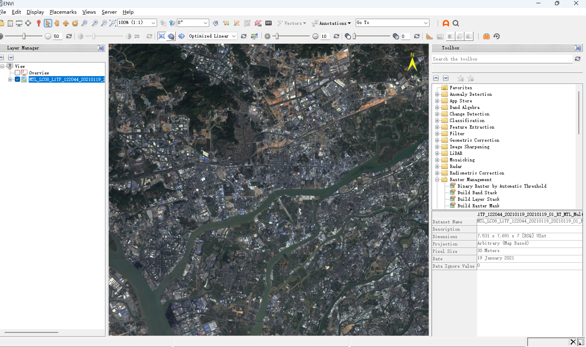
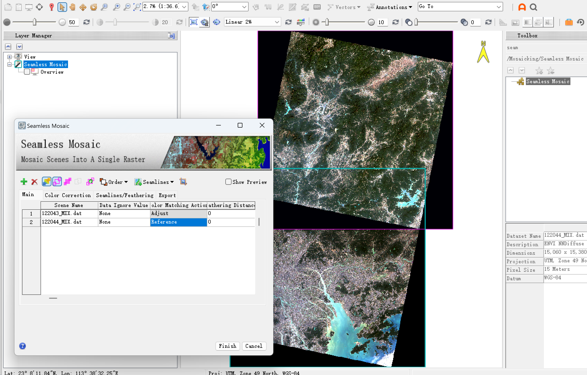
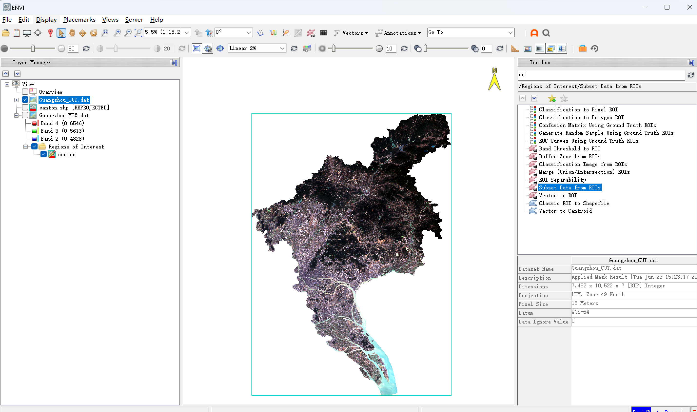
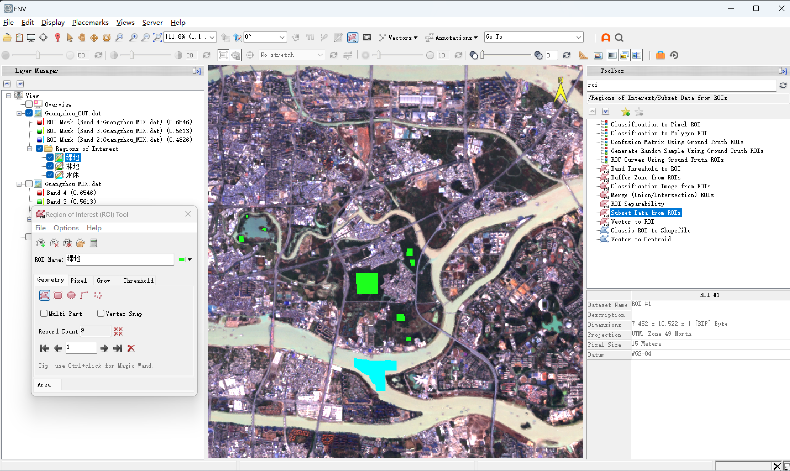
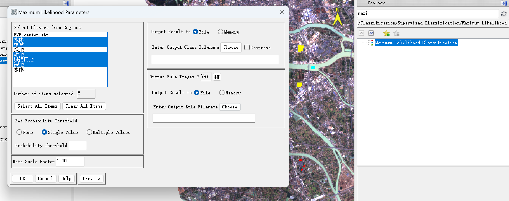
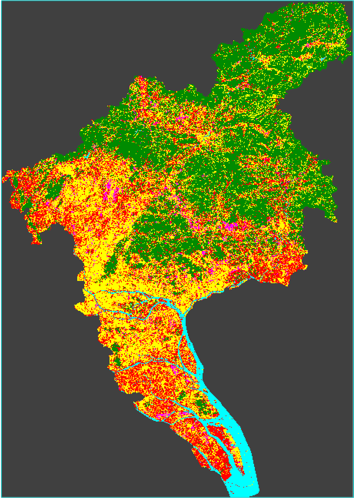
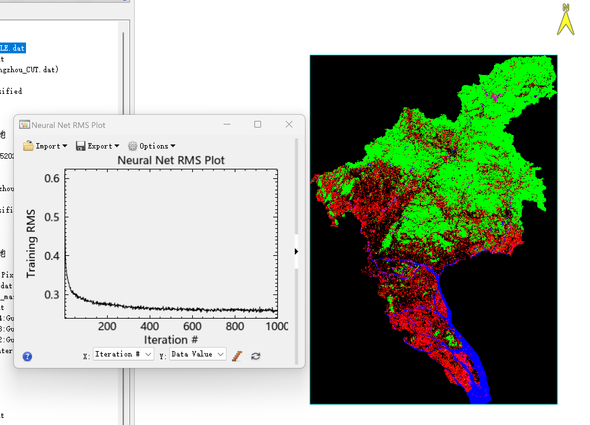
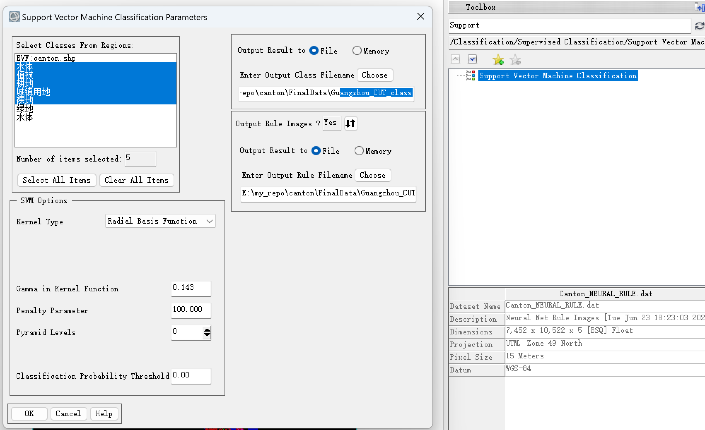

# 广州 Landsat 8 国土类型遥感监督分类实验

这是一个 GIS / 遥感实训项目记录，主要使用 ENVI 对广州市 Landsat 8 影像进行预处理、研究区裁剪、ROI 样本选取和监督分类实验。

本项目更偏向课程实训与个人学习归档，分类结果用于记录完整操作流程，不作为正式生产级土地覆盖制图成果。

## 实验流程

### 1. 影像读取与检查

首先在 ENVI 中打开 Landsat 8 影像，检查影像覆盖范围、波段信息、空间分辨率和显示效果。两景影像分别覆盖广州市及周边区域，后续需要进行预处理和镶嵌。

### 2. 辐射定标与大气校正

对 Landsat 8 影像进行辐射定标，将原始 DN 值转换为具有物理意义的辐亮度或反射率信息。随后使用 FLAASH 进行大气校正，减弱大气散射和吸收对地物光谱的影响，为后续分类提供更稳定的光谱基础。

### 3. 影像融合与无缝镶嵌

实验中将多光谱影像与全色波段进行融合，使影像空间分辨率提高到 15 m。由于研究区需要两景 Landsat 8 影像共同覆盖，因此进一步使用 Seamless Mosaic 工具进行无缝镶嵌，得到连续的广州市区域影像基础数据。

### 4. 研究区裁剪

使用广州市行政边界矢量数据对镶嵌后的影像进行裁剪，提取广州市范围内的研究区子集。裁剪后可以减少无关区域干扰，也能降低后续 ROI 选取和监督分类的处理范围。

### 5. ROI 样本选取

根据影像目视解译结果，在研究区内选取不同地类的 ROI 样本。当前实验采用 5 类地物：水体、植被、耕地、城镇用地、裸地。选样时尽量选择光谱特征相对明显、空间分布较分散的区域，避免所有样本集中在同一小块区域。

### 6. ROI 可分离性检查

完成 ROI 选取后，对样本进行可分离性检查，用于判断不同地类样本之间的光谱差异是否足够明显。广州地区存在城市、郊区、农田、裸地混合分布的情况，城镇用地、耕地和裸地之间容易出现光谱混淆，因此样本可分离性会直接影响后续分类结果。

### 7. 最大似然法分类

最大似然法基于各类别样本的统计特征进行分类，假设样本服从近似正态分布。实验中选取 ROI 样本作为训练区，输出最大似然分类结果图。

### 8. 神经网络分类

神经网络分类通过迭代训练样本来调整分类模型。实验中记录了 Neural Net RMS 收敛曲线，并输出对应分类结果。与最大似然法相比，神经网络结果在不同区域的类别分布有明显差异，但仍存在混合像元和椒盐噪声问题。

### 9. 支持向量机分类

支持向量机分类使用 RBF 核函数进行非线性分类，适合处理样本间边界较复杂的情况。由于研究区范围较大，SVM 在 ENVI 中运行时间较长，本实验记录了参数设置与运行过程，后续可继续补充完整分类结果和精度评价。

## 当前地类

当前实验使用 5 类地物：

| 类别 | 说明 |
| --- | --- |
| 水体 | 河流、水库、湖泊等水面 |
| 植被 | 林地、城市绿地及其他植被覆盖区域 |
| 耕地 | 农田、种植地等农业用地 |
| 城镇用地 | 建成区、道路、工业区等人工建设用地 |
| 裸地 | 裸露土壤、施工地、部分未覆盖地表 |

说明：早期曾尝试进一步区分绿地、林地等类别，但在 Landsat 8 分辨率和广州市复杂地表条件下，不同植被类型之间可分性较弱，因此当前阶段合并为植被类进行记录。

## 结果与问题

从当前分类结果看，水体的识别相对明显；植被区域整体较容易与其他类别区分；城镇用地、耕地和裸地之间存在较多混分。主要原因包括：

- 广州城市与郊区地物混合明显，像元内容复杂。
- Landsat 8 空间分辨率有限，一个像元内可能包含多种地物。
- 城镇用地、裸地、耕地在部分区域光谱特征接近。
- ROI 样本数量和空间分布仍会影响分类模型稳定性。

后续可以继续完成混淆矩阵精度评价，计算总体精度、Kappa 系数、生产者精度和用户精度，并对最大似然法、神经网络和支持向量机三种分类结果进行对比。

## 数据说明

大体积数据文件放在 GitHub Releases 中，不放在 main 分支。

| Release | 文件 | 说明 |
| --- | --- | --- |
| [Guangzhou_Shp](https://github.com/Wukeeeeee/Guangzhou-landsat8-lab/releases/tag/Guangzhou_Shp) | `CantonShp.zip` | 广州市行政边界矢量数据，用于研究区裁剪 |
| [Landsats8_Data_122043](https://github.com/Wukeeeeee/Guangzhou-landsat8-lab/releases/tag/Landsats8_Data_122043) | `LC81220432021019LGN00.zip` | Landsat 8 原始影像数据，轨道号 122/043 |
| [Landsats8_Data_122044](https://github.com/Wukeeeeee/Guangzhou-landsat8-lab/releases/tag/Landsats8_Data_122044) | `LC81220442021019LGN00.zip` | Landsat 8 原始影像数据，轨道号 122/044 |

`.dat`、`.hdr`、`.enp`、规则图像和其他 ENVI 中间结果文件体积较大，已通过 `.gitignore` 排除，不直接进入 Git 版本库。
