# 广州 Landsat 8 监督分类完整过程记录

本文件记录广州市 Landsat 8 影像监督分类实验的完整流程。实验使用 ENVI 完成影像预处理、ROI 样本选取、最大似然法、SVM 和神经网络三种监督分类，并对分类精度、图斑噪声和典型误分区域进行对比分析。

需要说明的是，本项目属于课程实训与方法对比记录，分类结果用于展示遥感监督分类流程和误差分析，不作为正式生产级土地覆盖制图成果。

## 1. 项目目标

本实验主要完成以下工作：

- 对两景 Landsat 8 影像进行读取、检查、辐射定标、大气校正、融合、镶嵌和研究区裁剪。
- 基于广州市研究区选取 ROI 样本，建立水体、植被、耕地、城镇用地和裸地五类地物。
- 分别使用最大似然法、SVM 和神经网络进行监督分类。
- 对三种分类结果进行精度评价、噪声处理和典型误分区域分析。
- 实事求是地评价分类结果的优点、问题和后续改进方向。

## 2. 数据与类别设置

本实验使用 Landsat 8 OLI/TIRS 影像，研究区为广州市。由于广州地物类型复杂，城市、河流、山地、水库、农田、工地和裸地交错明显，因此本次实验采用较概括的五类地物体系。

| 类别 | 说明 | 分类图颜色 |
| --- | --- | --- |
| 水体 | 河流、水库、湖泊等 | 青色 |
| 植被 | 林地、城市绿地及其他植被覆盖区域 | 绿色 |
| 耕地 | 农田、种植地等农业用地 | 红色 |
| 城镇用地 | 建成区、道路、工业区等人工建设用地 | 黄色 |
| 裸地 | 裸露土壤、施工地、未覆盖地表 | 紫红色 |
| 未分类/背景 | 研究区外或未分类区域 | 黑色 |

## 3. 影像读取与波段检查

首先在 ENVI 中打开 Landsat 8 影像，检查影像覆盖范围、波段加载情况和显示效果。两景影像需要共同覆盖广州市及周边区域，因此后续需要进行预处理和镶嵌。

随后在 Data Manager 中查看多光谱波段、全色波段和元数据信息。Landsat 8 多光谱波段空间分辨率为 30 m，全色波段为 15 m，这为后续全色融合提供基础。

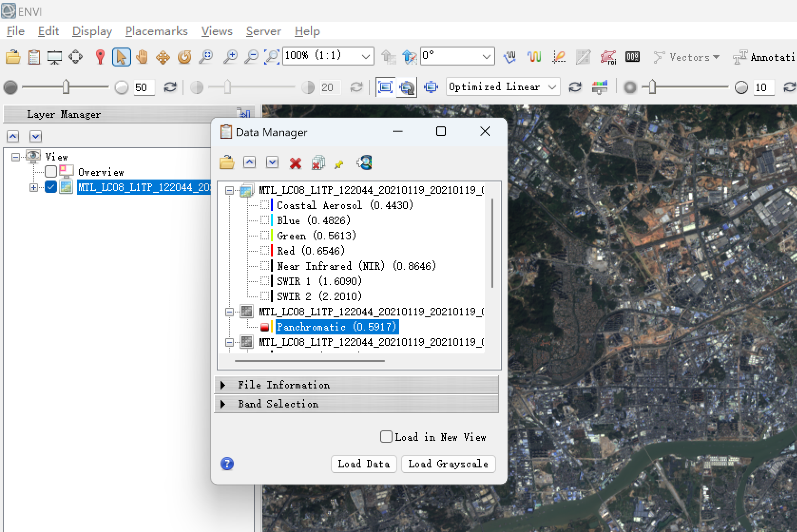

## 4. 辐射定标

对原始 Landsat 8 影像进行辐射定标，将 DN 值转换为具有物理意义的辐亮度数据。实验中选择 Radiance 作为定标类型，并输出 Float 类型数据，用作 FLAASH 大气校正输入。

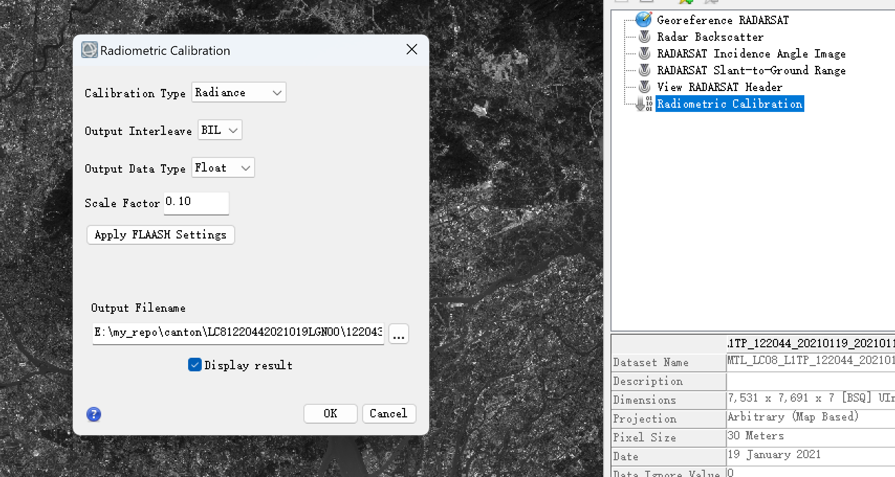

辐射定标是后续分类的基础步骤。如果直接使用原始 DN 值，影像亮度会受到传感器和成像条件影响，不利于不同地物光谱特征的稳定比较。

## 5. FLAASH 大气校正

辐射定标完成后，使用 FLAASH 进行大气校正。该步骤用于减弱大气散射和吸收影响，将辐亮度数据进一步转换为更适合分类分析的地表反射率数据。

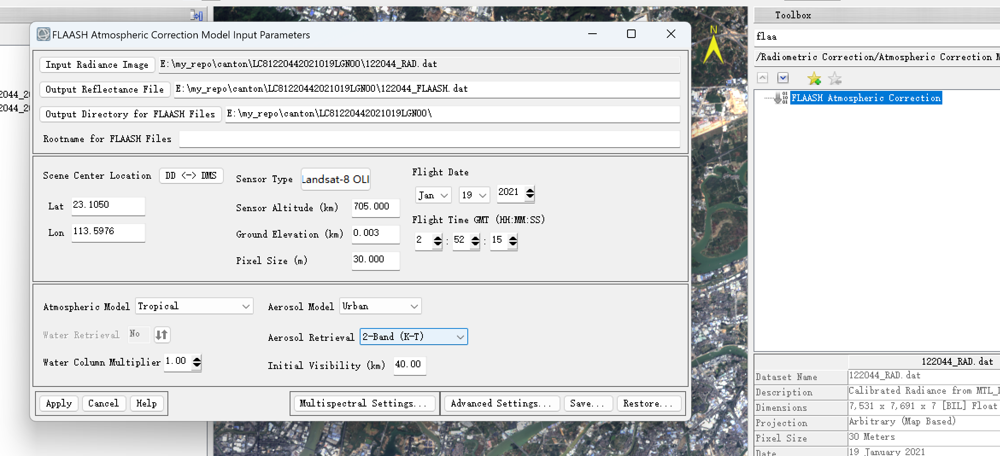

FLAASH 运行完成后，检查输出结果和运行信息，确认大气校正过程正常结束。

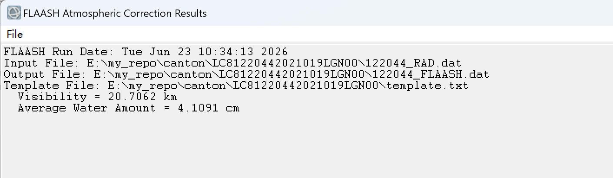

## 6. 全色融合与两景镶嵌

为了提高影像空间细节，本实验将多光谱影像与全色波段进行融合。融合后影像保留多光谱信息，同时空间细节更清晰。

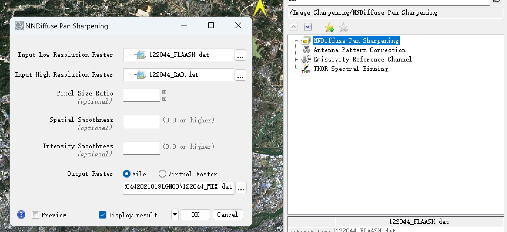

由于广州市范围需要两景 Landsat 8 影像共同覆盖，因此进一步使用 Seamless Mosaic 工具进行无缝镶嵌，得到连续的研究区基础影像。

## 7. 研究区裁剪

使用广州市行政边界矢量数据对镶嵌后的影像进行裁剪，提取广州市范围内的研究区子集。裁剪后可以减少无关区域干扰，也能降低 ROI 选取和监督分类的处理范围。

## 8. ROI 样本选取

根据影像目视解译结果，在研究区内选取水体、植被、耕地、城镇用地和裸地五类 ROI 样本。选样时尽量选择光谱特征相对明显、空间分布较分散的区域。

ROI 样本质量对监督分类结果影响很大。本次实验结果中出现江岸、水库和城郊过渡带局部误分，说明样本覆盖仍不够充分，尤其是阴影水体、浅水、浑浊水、库岸、道路、裸地和干旱耕地等复杂样本需要进一步补充。

## 9. 三种监督分类方法

### 9.1 最大似然法

最大似然法基于各类别训练样本的统计特征进行分类，假设各类别光谱特征近似服从正态分布。该方法实现简单、可解释性强，但对样本代表性和类别统计分布比较敏感。

### 9.2 SVM

SVM 使用核函数构建类别间的非线性边界，适合处理高维特征空间中的分类问题。本实验中 SVM 使用 RBF 核函数。实际结果显示，SVM 在局部水体轮廓保持方面相对较好。

### 9.3 神经网络

神经网络通过迭代训练样本来拟合类别边界。本实验中神经网络在验证样本下总体精度最高，但在山地水库和江岸混合区仍存在明显局部误分。

## 10. 三种分类结果横向对比

三种方法的最终分类结果如下。图像顺序为最大似然法、SVM、神经网络。

| 最大似然法 | SVM | 神经网络 |
| --- | --- | --- |
| 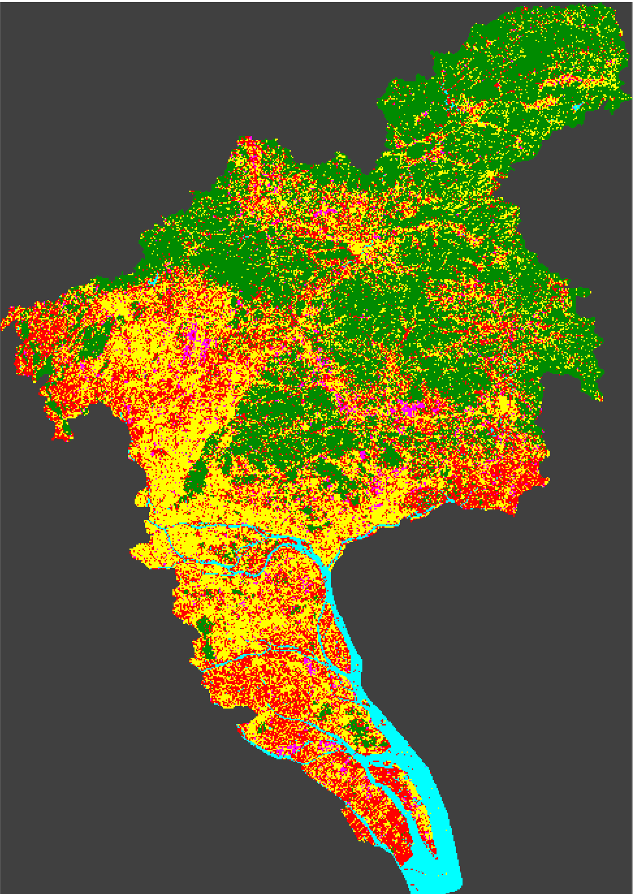 |  | 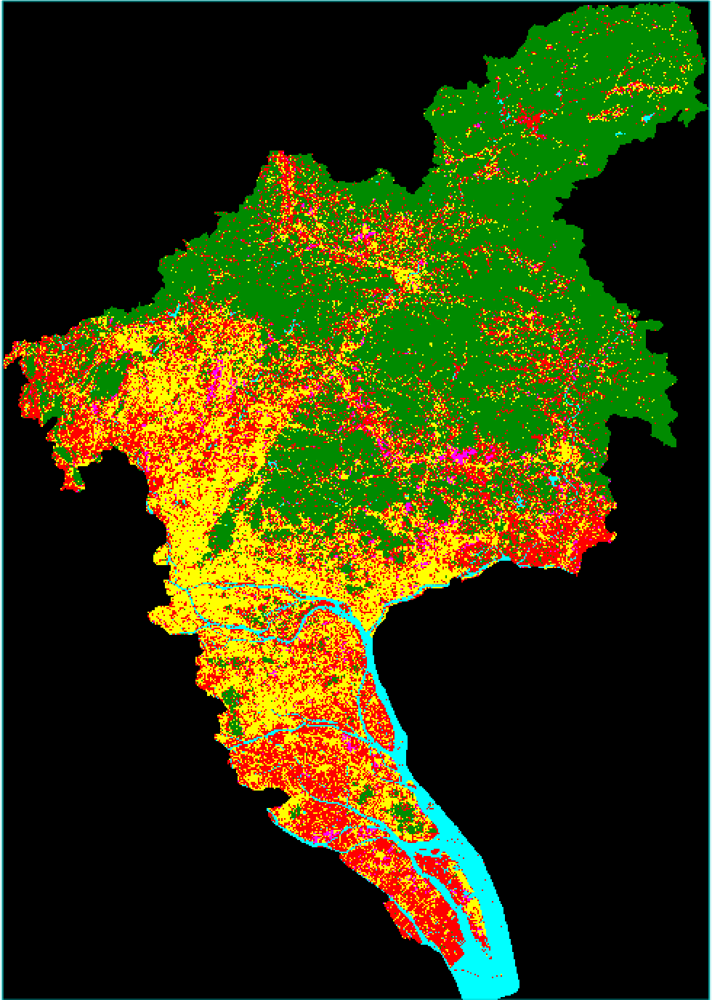 |

从整体视觉效果看：

- 最大似然法图斑最碎，椒盐噪声较明显，城镇用地、耕地和裸地之间混分较多。
- SVM 结果整体较稳定，尤其在部分水体区域，河流和水库轮廓保持相对较好。
- 神经网络在验证样本下总体精度最高，图斑也相对平滑，但局部区域仍有不合理误分。

因此，本次实验不能只按照总体精度判断分类效果，还需要结合局部图像和原始影像进行解释。

## 11. 精度评价

三种分类方法的总体精度和 Kappa 系数如下。

| 方法 | 总体精度 OA | Kappa 系数 | 简要评价 |
| --- | ---: | ---: | --- |
| 最大似然法 | 94.9920% | 0.9348 | 精度最低，图斑最碎 |
| SVM | 96.5889% | 0.9556 | 精度居中，局部水体保持较好 |
| 神经网络 | 98.5637% | 0.9814 | 验证样本下最高，但局部仍有误分 |

从精度表看，神经网络最高，SVM 次之，最大似然法最低。但精度评价依赖验证样本，如果验证样本主要落在比较典型、容易识别的区域，就可能掩盖江岸、库岸、阴影和城郊过渡带的局部问题。

本次实验中水体在验证样本上的精度较高，但局部图像中仍出现水体误分，说明验证样本未能完全覆盖复杂水体场景。

## 12. 噪声处理对比

本实验使用 Majority/Minority Analysis 对分类结果进行椒盐噪声处理。处理时采用 Majority 方法和 3 × 3 窗口，对孤立像元进行邻域多数类替换。

### 12.1 最大似然法噪声处理

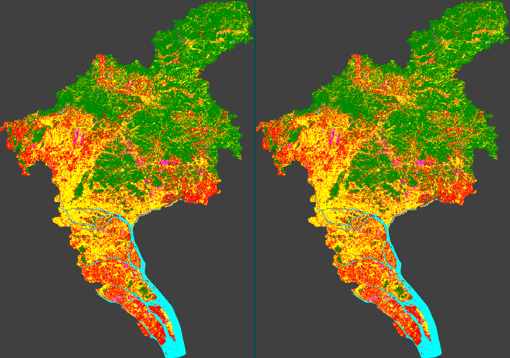

最大似然法原始分类图斑较碎，噪声处理后零散斑点有所减少，但局部边界也会被平滑。

### 12.2 SVM 噪声处理

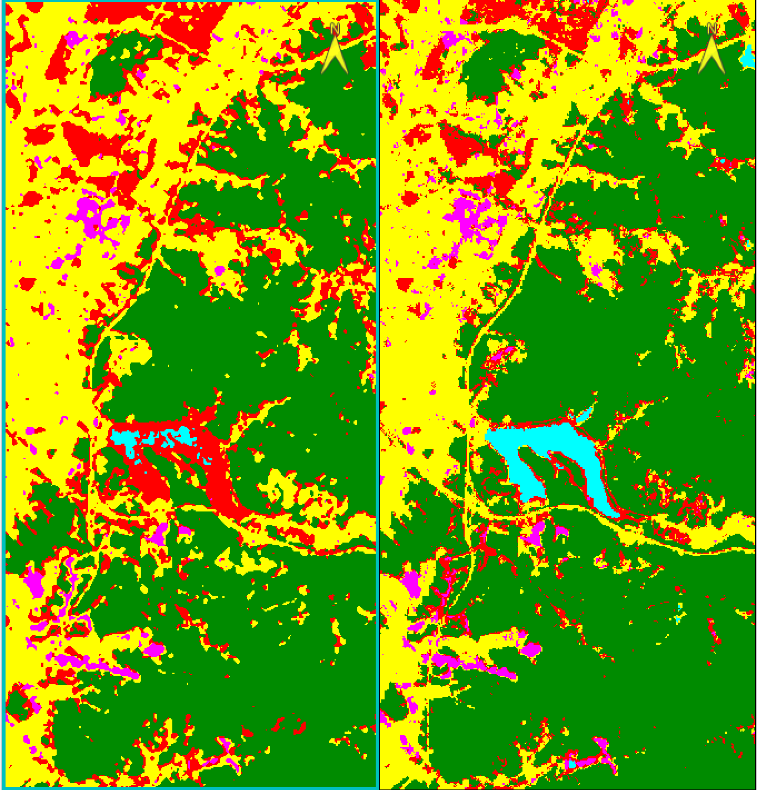

SVM 原始结果相对稳定，噪声处理后主要表现为少量孤立像元被合并。

### 12.3 神经网络噪声处理

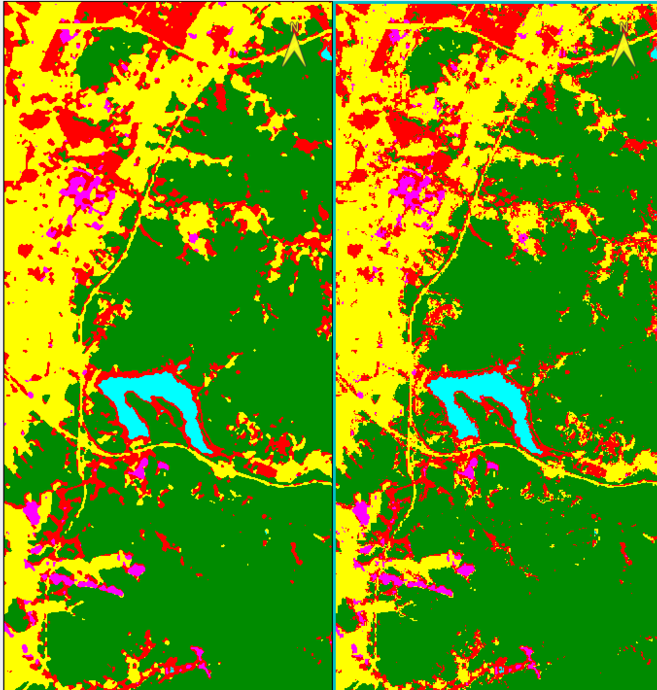

神经网络结果图斑连续性较好，后处理可以进一步减少局部噪声，但不能解决训练样本不足导致的根本误分。

需要强调的是，噪声处理只能改善制图表现，不能替代重新选样本、增加特征或重新分类。

## 13. 典型误分区域分析

### 13.1 江岸城市混合区

下图为珠江两岸高密度建成区的局部对比。左上为最大似然法，左下为 SVM，右上为神经网络，右下为原始影像。

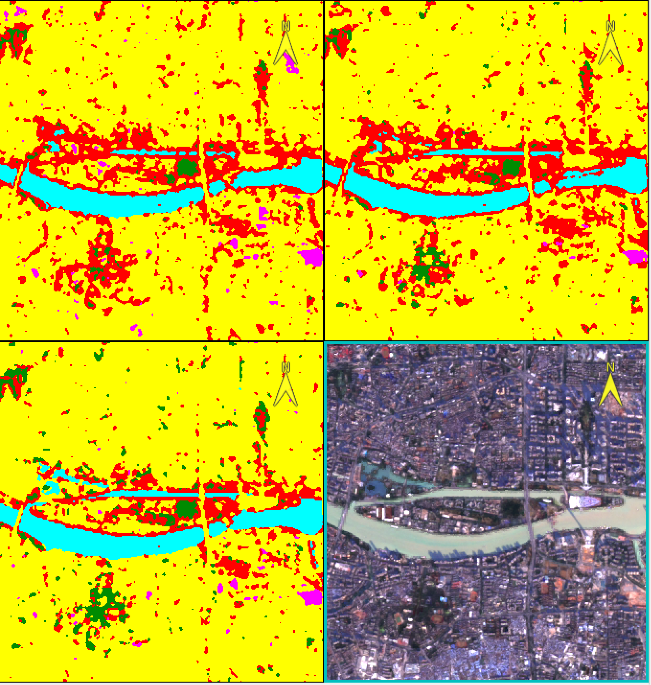

该区域包含河流、桥梁、道路、建筑、绿地、裸露地表和岸线浅水区。三种方法均能识别主体水体的大致形态，但江岸两侧存在明显混分。

主要问题包括：

- 江岸区域的水体、道路、建筑和绿地混在一个或多个像元中，容易形成混合像元。
- 城镇用地、裸地和耕地在局部区域光谱相近，黄色、红色和紫红色类别容易互相混分。
- 神经网络虽然总体精度最高，但局部江岸区域仍不能完全避免误分。
- 部分江边区域被分成耕地或城镇用地，与原始影像中的江岸实际地物不完全一致，说明分类器对江岸浅水、桥梁、岸线建筑和道路绿地混合区域的表达能力不足。

这个案例说明，广州市复杂城市地物下，局部分类效果不能只依赖总体精度评价。

### 13.2 山地水库区

下图为山地水库及周边谷地的局部对比。左上为最大似然法，左下为 SVM，右上为神经网络，右下为原始影像。

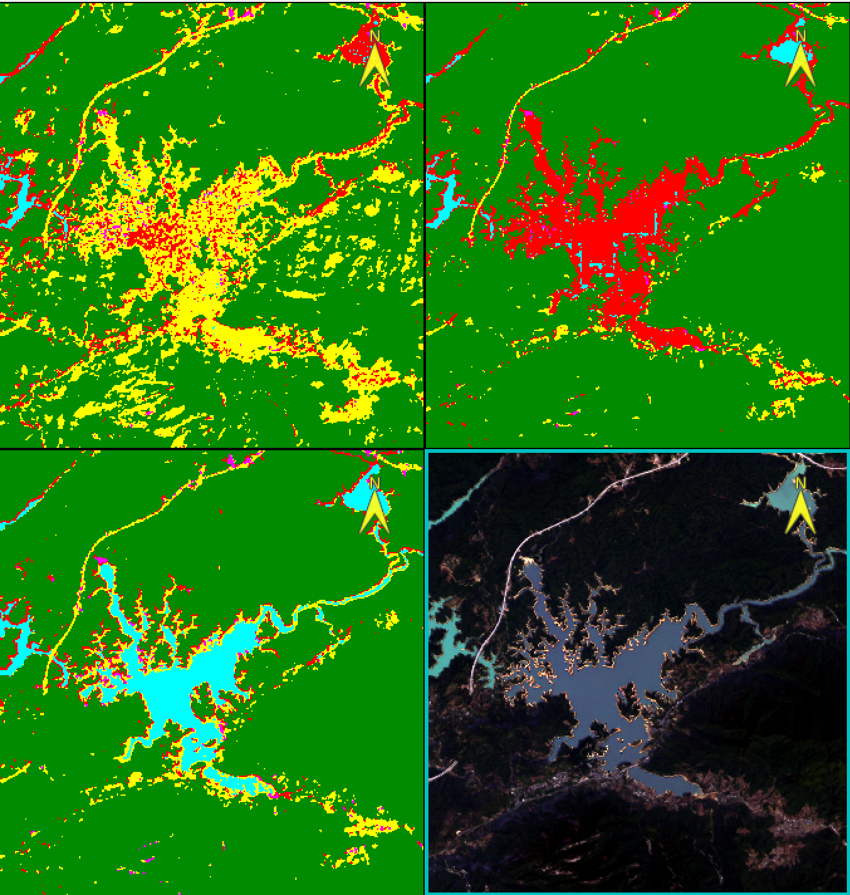

从该区域看，三种方法对大面积山地植被的识别整体较一致，但在水库、库岸和谷地开阔区域差异明显。

具体表现为：

- 最大似然法中黄色和红色斑块较碎，容易把部分山地边缘、道路或裸露地表判为城镇用地或耕地。
- SVM 对主水体轮廓保留相对较完整，但岸线附近仍存在零散混分。
- 神经网络图斑较平滑，但本例中部分水库或谷地区域被判为耕地，说明总体精度最高并不代表每个局部区域都最准确。
- 部分河流和水库水体没有被稳定识别出来，尤其是库岸、山体阴影、浅水和谷地开阔区域，容易被误分为耕地或其他类别。

可能原因包括：

- 山地阴影、深水、浑浊水和暗色植被在光谱上可能接近。
- 水库岸线存在浅水、湿地、裸露地表和植被混合像元。
- 道路、裸地、城镇用地和干旱耕地的光谱差异不明显。
- ROI 样本没有充分覆盖这些复杂场景。
- 水体样本可能更偏向开阔、典型水面，对阴影水体、浅水、浑浊水和窄河道代表性不足。

## 14. 实事求是的结果评价

本次实验完成了完整的监督分类流程，结果可以用于方法对比和误差分析，但分类质量并不适合作为高精度土地覆盖制图成果。

三种方法的实际表现可以概括为：

- 最大似然法：整体效果最弱，图斑破碎，椒盐噪声明显，城镇用地、耕地和裸地混分较多。
- SVM：总体精度居中，但局部视觉效果相对稳定，尤其在水体轮廓保持方面表现较好。
- 神经网络：验证样本下 OA 和 Kappa 最高，但在江岸、水库和谷地等复杂局部区域仍出现明显误分。

因此，本次结果更适合作为“监督分类方法对比实验”，而不是直接作为精细土地利用分类成果。

## 15. 问题原因总结

本次分类结果存在局部误分，主要原因包括：

1. 广州市地物复杂，城市、农田、裸地、水体和植被交错明显。
2. Landsat 8 空间分辨率有限，30 m 像元内容易混合多种地物。
3. 城镇用地、裸地、耕地、道路和部分干旱地表光谱特征接近。
4. 江岸、库岸、阴影水体、浅水和浑浊水等复杂样本覆盖不足。
5. 验证样本可能偏向典型地物，未充分反映难分类区域。
6. 后处理只能减少椒盐噪声，不能从根本上修正错误类别。

## 16. 后续改进方向

如果后续需要提高分类质量，可以从以下方面改进：

- 重新补充 ROI 样本，重点增加阴影水体、浅水、浑浊水、库岸、道路、裸地、工地、干旱耕地和城郊过渡带样本。
- 验证样本需要覆盖难点区域，不能只选取典型、容易识别的地物。
- 引入 NDWI、MNDWI 等水体指数，提高水体与阴影、植被、裸地之间的区分能力。
- 对光谱相近且难以稳定区分的类别进行合并或重新定义。
- 在分类后结合目视检查和必要的人工修正，避免直接使用未经检查的分类图作为最终成果。

## 17. 成果文件

本项目当前整理出的主要成果文件包括：

- [最终报告 PDF](guangzhou_landsat8_classification_report.pdf)
- [展示 PPT](guangzhou_landsat8_classification_presentation.pptx)
- [可编辑报告 DOCX](guangzhou_landsat8_classification_report.docx)

大体积 ENVI 数据和中间结果不建议上传到 GitHub 主分支，应通过 `.gitignore` 排除，或放在 Releases / 外部网盘中单独管理。
